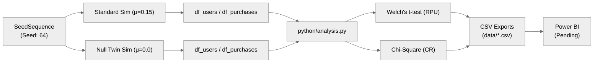

# data-pipeline

A/B testing simulation and statistical analysis pipeline.

## Project Purpose
This pipeline simulates large-scale user transactional data under controlled* A/B testing conditions. It executes statistical hypothesis tests to detect treatment effects and outputs clean datasets, providing a structured, verifiable data source for downstream feeding into Power BI dashboards.

## Methodology & Architecture

The pipeline runs two parallel simulation flows: a standard configuration (incorporating a simulated treatment effect) and a null twin configuration (A/A test) to validate statistical precision.



### 1. Data Simulation (`python/simulation.py`)
This module generates the synthetic user base and transactional history. To ensure the simulated data remains reproducible and mathematically decoupled across experimental groups, the random streams are isolated using independent sub-seeds. This prevents modifications in one stream from altering the properties of another:

*   **RNG isolation**: A single root `SeedSequence(seed=64)` spawns 9 independent child generators to prevent cross-stream contamination:
    *   **1.** Group selection RNG
    *   **2.** Region selection RNG
    *   **3.** Control buyer draw RNG
    *   **4.** Variant buyer draw RNG
    *   **5.** Purchase user ID RNG
    *   **6.** Timestamp offset RNG
    *   **7.** Control multiplier RNG
    *   **8.** Variant multiplier RNG
    *   **9.** Purchase baseline value RNG

    *Note: By doing this, changing the sample size or properties of the Variant group has zero downstream impact on the Control group. It remains identical across both Standard and Null runs.*
*   **User Population (5,000,000 users)**:
    *   `userid`: Continuous sequence `[0, 4,999,999]`.
    *   `group`: Assigned via binomial choice (50% Control, 50% Variant).
    *   `region`: Assigned via multinomial choice (25% ASIA, 25% EMEA, 25% LATAM, 25% NA).
*   **Conversion (Buyer Draw)**:
    *   Control active buyer pool: 100,000 unique users drawn without replacement from the Control population.
    *   Variant active buyer pool:
        *   *Standard run*: 150,000 unique users drawn without replacement (simulates conversion lift).
        *   *Null Twin run*: 100,000 unique users drawn without replacement (simulates A/A baseline).
*   **Transactions (500,000 events)**:
    *   `userid`: Sampled with replacement from the active buyer pool.
    *   `timestamp`: Distributed uniformly across a 31-day window starting `2026-07-01`.
    *   `value`: Calculated by drawing a base price uniformly from `[10, 25]`, multiplying it by a user-specific multiplier `M`, rounding to the nearest integer, and adding a `$0.99` cent offset:
        $$\text{Value} = \text{round}(\text{Base} \times M) + 0.99$$
        *   **Control & Null Variant**: Multiplier `M ~ Lognormal(0.0, 0.5)` (no average order value lift).
        *   **Standard Variant**: Multiplier `M ~ Lognormal(0.15, 0.5)` (simulating a ~16% average order value lift).

### 2. Statistical Analysis (`python/analysis.py`)
This module aggregates the simulated user and transaction tables to compute treatment effects and evaluate statistical significance. By grouping events before analysis, it ensures that statistical assumptions are met and lifts are measured accurately:

*   **User-Level Roll-up**:
    *   Transactions are grouped by `userid` to calculate total spend per user.
    *   This is left-joined back to the user registry, and non-buyers are filled with 0.
    *   *Why this matters*: Running statistical tests directly on event-level transactions would violate the independence assumption (i.i.d.) due to repeated purchases by the same user, resulting in false confidence (inflated Type I error rates).
*   **Hypothesis Testing**:
    *   **Conversion Rate Significance**: Pearson's Chi-Square Test of independence evaluates conversion status (buyer vs. non-buyer) counts across Control and Variant groups.
    *   **Revenue Per User (RPU) Significance**: Welch's t-test (two-sample independent, unequal variances) evaluates user-level spend. Welch's formulation is selected because the lognormal multiplier in the Variant group introduces higher variance, violating the equal-variance assumption of a standard Student's t-test.
*   **Regional Segmentation & Lift**:
    *   To guard against Simpson's Paradox, significance tests are run both globally and split by region (EMEA, NA, ASIA, LATAM) to prevent regional variations in baseline rates from skewing aggregate results.
    *   Segmented p-values and metric lifts (for Conversion Rate, Average Order Value, and Revenue Per User) are calculated as `(Variant - Control) / Control`.

---

## Comparative Validation (Standard vs. Null Twin)

To verify that the statistical tests behave correctly under null conditions and do not generate false positives (Type I errors), the pipeline runs a Parallel A/A "Null Twin" simulation side-by-side with the standard A/B test. The comparison below demonstrates how the statistical indicators react when no treatment effect is present:

| Metric / Dimension | Standard Run (A/B Test) | Null Twin (A/A Test) | Expectation / Validation |
| :--- | :--- | :--- | :--- |
| **Conversion, global p-value** | 0.0000 | 0.7636 | Reject Null vs. Accept Null |
| **Global Revenue (RPU), global p-value** | 0.0000 | 0.9018 | Reject Null vs. Accept Null |
| **Conversion lift, by region** | +48.12% to +52.29% | -0.82% to +1.19% | Positive Lift vs. Statistical Noise |
| **RPU lift, by region** | +71.77% to +75.33% | -1.25% to +1.42% | Positive Lift vs. Statistical Noise |
| **Regions significant** | p < 0.001 (All Regions) | p >= 0.197 (None) | Significant vs. Non-Significant |

---

## Local Execution Guide

To get the pipeline up and running and generate the metrics files on your local machine:

1. **Clone the repository** (requires [Git](https://git-scm.com/)):
   ```bash
   git clone https://github.com/vxqzn/data-pipeline.git
   ```
   ```bash
   cd data-pipeline
   ```
2. **Set up the virtual environment**:
   ```bash
   python -m venv .venv
   ```
3. **Activate the environment**:
   - Windows PowerShell:
     ```powershell
     .venv\Scripts\Activate.ps1
     ```
   - Linux/macOS:
     ```bash
     source .venv/bin/activate
     ```
4. **Install dependencies**:
   ```bash
   pip install -r requirements.txt
   ```
5. **Execute the analysis**:
   ```bash
   python python/analysis.py
   ```
   This runs both simulation configurations and outputs the resulting CSV aggregates directly to the `data/` folder.

---

## Repository Map

Directory structure separating code, data, and presentation layers:

*   **[python/simulation.py](python/simulation.py)**: Python generator module implementing lognormal multipliers and seeded sub-stream data generation.
*   **[python/analysis.py](python/analysis.py)**: Metrics aggregation logic executing Welch's t-test and Chi-square calculations globally and per-region.
*   **[data/std_metrics_results.csv](data/std_metrics_results.csv)**: Regional aggregated metrics and statistical tests output for the standard test configuration.
*   **[data/null_metrics_results.csv](data/null_metrics_results.csv)**: Regional aggregated metrics and statistical tests output for the null (A/A) twin configuration.
*   **[powerbi/ab_testing_dashboard.pbix](powerbi/ab_testing_dashboard.pbix)**: Power BI report visualising aggregate conversion, AOV, RPU, and region-level treatment significance.
*   **[requirements.txt](requirements.txt)**: Core dependencies (`pandas`, `numpy`, `scipy`).

## Project Status

- [x] Data Simulation (`python/simulation.py`)
- [x] Statistical Analysis (`python/analysis.py`)
- [x] Data Export (`data/std_metrics_results.csv`, `data/null_metrics_results.csv`)
- [ ] Power BI Dashboard (Pending onboarding of the generated CSV exports)

## Notes
See **[NOTES.md](NOTES.md)** more depth.
